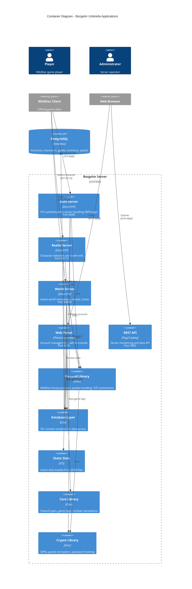

# C4 Container Diagram

This diagram shows the high-level technical building blocks (Elixir umbrella apps) that make up Bezgelor.



## Container Descriptions

### Server Layer (Network-Facing)

| Container | Technology | Port | Responsibility |
|-----------|------------|------|----------------|
| **Auth Server** | Elixir/OTP, Ranch | 6600 | SRP6 authentication, game token generation |
| **Realm Server** | Elixir/OTP, Ranch | 23115 | Character list, realm selection, session keys |
| **World Server** | Elixir/OTP, Ranch | 24000 | Game simulation, zones, combat, entities |
| **Web Portal** | Phoenix LiveView | 4000 | Account dashboard, character viewer, admin |
| **REST API** | Plug/Cowboy | 4002 | Server monitoring, data queries |

### Foundation Layer (Shared Libraries)

| Container | Technology | Responsibility |
|-----------|------------|----------------|
| **Protocol Library** | Elixir | Binary protocol parsing, packet handlers, TCP connections |
| **Database Layer** | Ecto | Context modules for all database operations |
| **Static Data** | ETS | In-memory game data (creatures, spells, items, zones) |
| **Core Library** | Elixir | Shared types (Entity, Vector3), game calculations |
| **Crypto Library** | Elixir | SRP6 algorithm, packet encryption, password hashing |

### Data Storage

| Container | Technology | Responsibility |
|-----------|------------|----------------|
| **PostgreSQL** | Database | Persistent storage for all game data |

## Data Flow

```
Player Login Flow:
1. Client → Auth (6600): SRP6 authentication → Game token
2. Client → Realm (23115): Token validation → Character list → Session key
3. Client → World (24000): Session validation → World entry → Gameplay
```
