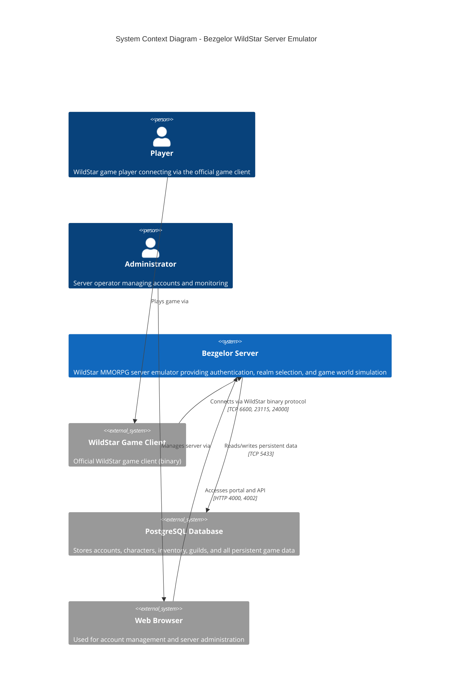

# C4 System Context Diagram

This diagram shows Bezgelor (WildStar Server Emulator) and its relationships with external actors and systems.

## Actors

| Actor | Description |
|-------|-------------|
| **Player** | End user playing WildStar through the official game client |
| **Administrator** | Server operator with access to the web portal for management |

## External Systems

| System | Description | Protocol |
|--------|-------------|----------|
| **WildStar Game Client** | Official game client binary connecting to game servers | WildStar Binary Protocol |
| **PostgreSQL Database** | Persistent storage for all game data | Port 5433 (non-standard) |
| **Web Browser** | Access point for portal and API interfaces | HTTP/HTTPS |

## Communication Flows

1. **Player → Game Client → Bezgelor**: Players use the WildStar client to connect to game servers
2. **Admin → Browser → Bezgelor**: Administrators manage the server via web portal (port 4000) or API (port 4002)
3. **Bezgelor → PostgreSQL**: All persistent data (accounts, characters, guilds, inventory, etc.)
