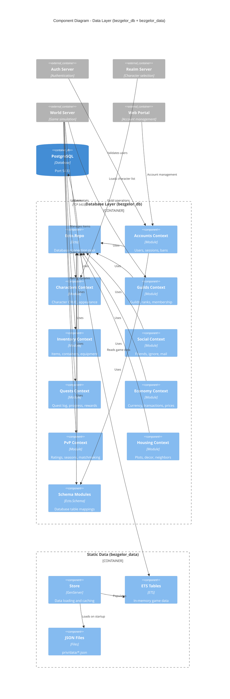

# C4 Component Diagram - Data Layer

This diagram shows the data architecture including both persistent (PostgreSQL) and in-memory (ETS) data stores.



## Database Contexts (bezgelor_db)

Each context provides a public API for a domain:

| Context | Tables | Responsibility |
|---------|--------|----------------|
| **Accounts** | users, sessions, bans | User authentication, session management |
| **Characters** | characters, character_appearance, stats | Character CRUD, customization |
| **Guilds** | guilds, guild_members, guild_ranks | Guild management, permissions |
| **Inventory** | items, containers, equipped_items | Item storage, equipment |
| **Social** | friends, ignored, mail | Social features, messaging |
| **Quests** | quest_log, quest_progress | Quest tracking, completion |
| **Economy** | currency, transactions, vendor_prices | Gold, commodities, trading |
| **PvP** | arena_ratings, bg_stats, seasons | Competitive rankings |
| **Housing** | housing_plots, decor, neighbors | Player housing |

Additional contexts: Instances, Pets, Mounts, Achievements, Paths, Reputation, Trading

## Static Data (bezgelor_data)

Loaded into ETS on startup from JSON files:

| Data Type | Source File | Contents |
|-----------|-------------|----------|
| **Creatures** | creature2.json | Spawns, stats, loot tables |
| **Spells** | spell4.json | Abilities, effects, cooldowns |
| **Items** | item2.json | Equipment, consumables |
| **Zones** | worldzone.json | Zone definitions, bounds |
| **Achievements** | achievement.json | Categories, criteria |
| **Classes** | class.json | Abilities, progression |

## Data Access Patterns

```elixir
# Persistent data (Ecto)
BezgelorDb.Characters.get_character!(character_id)
BezgelorDb.Inventory.add_item(character_id, item_id, count)
BezgelorDb.Guilds.create_guild(params)

# Static data (ETS - O(1) lookup)
BezgelorData.creatures(creature_id)
BezgelorData.spells(spell_id)
BezgelorData.zones(zone_id)
```

## Schema Organization

```
lib/bezgelor_db/schema/
├── user.ex                 # Account schema
├── character.ex            # Character schema
├── character_appearance.ex # Customization
├── guild.ex               # Guild schema
├── guild_member.ex        # Membership
├── item.ex                # Inventory item
├── quest_log.ex           # Quest progress
└── ...                    # 30+ schemas
```
