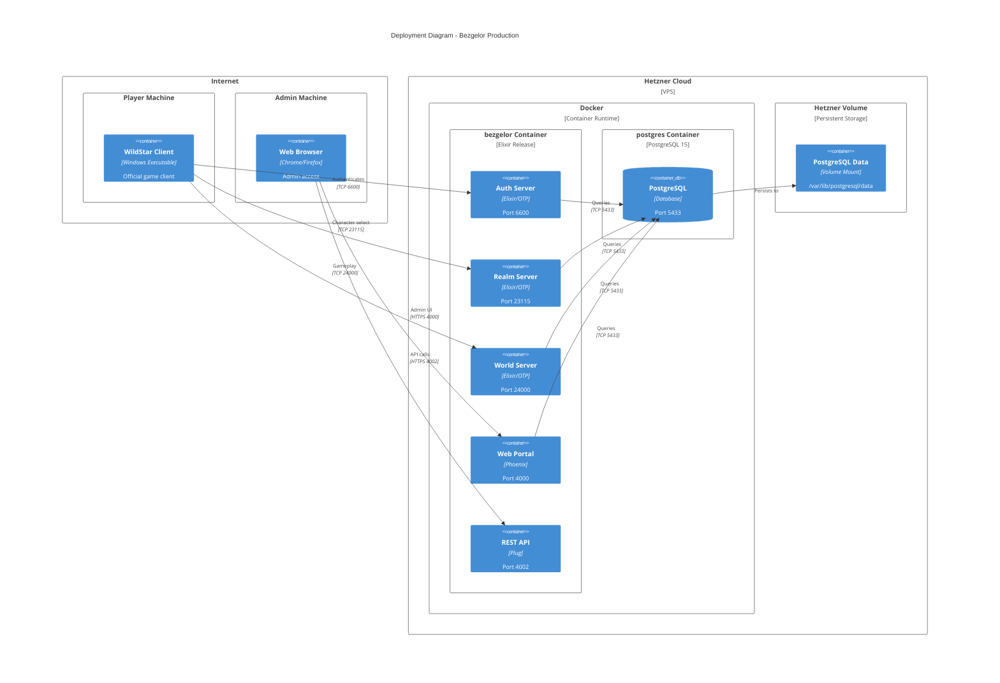

# C4 Deployment Diagram

This diagram shows how Bezgelor is deployed in production.



## Deployment Components

### Application Container

| Component | Port | Protocol | Purpose |
|-----------|------|----------|---------|
| Auth Server | 6600 | TCP/Binary | SRP6 authentication |
| Realm Server | 23115 | TCP/Binary | Character selection |
| World Server | 24000 | TCP/Binary | Game world simulation |
| Web Portal | 4000 | HTTP/WS | Admin interface |
| REST API | 4002 | HTTP | Monitoring and data |

### Database Container

| Component | Port | Purpose |
|-----------|------|---------|
| PostgreSQL | 5433 | Persistent data storage |

### Persistent Storage

| Volume | Mount Point | Purpose |
|--------|-------------|---------|
| Hetzner Volume | /var/lib/postgresql/data | Database files survive container restarts |

## Network Configuration

```
External Access:
  - 6600/tcp   → Auth Server
  - 23115/tcp  → Realm Server
  - 24000/tcp  → World Server
  - 4000/tcp   → Web Portal (optional, can be internal)
  - 4002/tcp   → REST API (optional, can be internal)

Internal Only:
  - 5433/tcp   → PostgreSQL (container network only)
```

## Release Configuration

The Elixir release includes all umbrella apps:

```elixir
# mix.exs release config
releases: [
  bezgelor_portal: [
    applications: [
      bezgelor_portal: :permanent,
      bezgelor_auth: :permanent,
      bezgelor_realm: :permanent,
      bezgelor_world: :permanent,
      bezgelor_db: :permanent,
      bezgelor_data: :permanent,
      bezgelor_core: :permanent,
      bezgelor_crypto: :permanent,
      bezgelor_protocol: :permanent
    ]
  ]
]
```

## Environment Variables

| Variable | Default | Purpose |
|----------|---------|---------|
| `AUTH_PORT` | 6600 | Auth server listen port |
| `REALM_PORT` | 23115 | Realm server listen port |
| `WORLD_PORT` | 24000 | World server listen port |
| `WORLD_PUBLIC_ADDRESS` | - | Public IP for client connections |
| `POSTGRES_HOST` | localhost | Database host |
| `POSTGRES_PORT` | 5433 | Database port |
| `POSTGRES_DB` | bezgelor | Database name |
| `POSTGRES_USER` | - | Database user |
| `POSTGRES_PASSWORD` | - | Database password |
| `SECRET_KEY_BASE` | - | Phoenix secret key |
