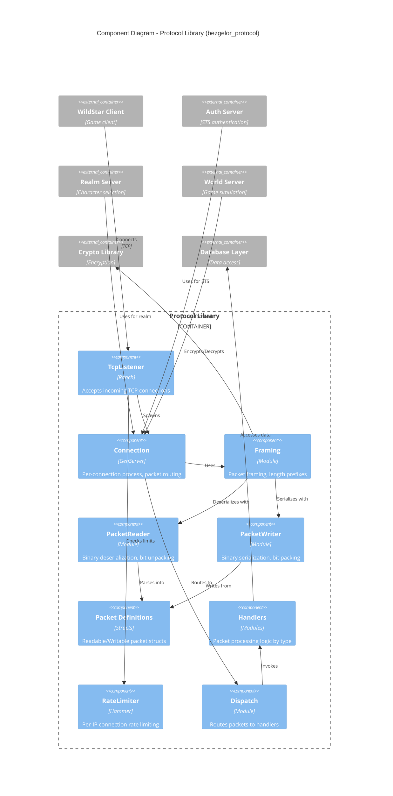

# C4 Component Diagram - Protocol Library

This diagram shows the internal components of the Protocol Library (bezgelor_protocol), which handles all network communication.



## Component Descriptions

### Network Layer

| Component | Technology | Responsibility |
|-----------|------------|----------------|
| **TcpListener** | Ranch | Accepts incoming TCP connections, spawns connection handlers |
| **Connection** | GenServer | Per-client process managing socket, state machine, packet routing |
| **RateLimiter** | Hammer | Prevents connection abuse (per-IP limits) |

### Serialization Layer

| Component | Technology | Responsibility |
|-----------|------------|----------------|
| **Framing** | Module | Packet length prefixing, encryption wrapper |
| **PacketReader** | Module | Bit-packed binary deserialization |
| **PacketWriter** | Module | Bit-packed binary serialization |

### Protocol Layer

| Component | Technology | Responsibility |
|-----------|------------|----------------|
| **Packet Definitions** | Structs | Type-safe packet structs with Readable/Writable behaviours |
| **Dispatch** | Module | Routes packets to appropriate handlers by opcode |
| **Handlers** | Modules | Business logic for each packet type |

## Packet Types

```
packets/
├── realm/                      # Realm server packets
│   ├── client_*.ex            # Client → Server
│   └── server_*.ex            # Server → Client
└── world/                      # World server packets
    ├── client_*.ex            # Client → Server (movement, combat, chat)
    └── server_*.ex            # Server → Client (updates, spawns)
```

## Packet Flow

```
Incoming:
  TCP Socket
    → Connection.handle_info(:tcp, data)
    → Framing.decode (length prefix)
    → PacketCrypt.decrypt
    → PacketReader.read (bit unpacking)
    → Dispatch.route (by opcode)
    → Handler.handle
    → Response packets

Outgoing:
  Handler returns packets
    → PacketWriter.write (bit packing)
    → PacketCrypt.encrypt
    → Framing.encode (length prefix)
    → :gen_tcp.send
```

## Connection Types

The Connection GenServer operates in different modes:

| Mode | Port | Protocol | Purpose |
|------|------|----------|---------|
| `:realm` | 23115 | Binary | Character selection, session setup |
| `:world` | 24000 | Binary | Game world, all gameplay packets |

Note: Auth server (port 6600) uses a separate STS connection handler.
