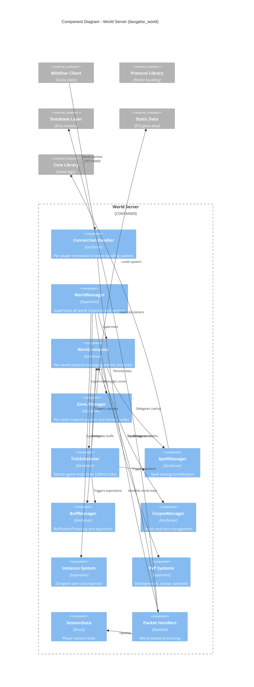

# C4 Component Diagram - World Server

This diagram shows the internal components of the World Server (bezgelor_world), the most complex container.



## Component Descriptions

### Connection Layer

| Component | Process Type | Responsibility |
|-----------|--------------|----------------|
| **Connection Handler** | GenServer (per player) | Manages player TCP connection, packet I/O |
| **Packet Handlers** | Modules | Process specific packet types (movement, combat, etc.) |
| **SessionData** | Struct | Player session state (position, target, flags) |

### World Management

| Component | Process Type | Responsibility |
|-----------|--------------|----------------|
| **WorldManager** | Supervisor | Top-level supervisor for all world processes |
| **World.Instance** | GenServer (per world) | Manages entities, visibility, state for one world |
| **Zone.Manager** | GenServer (per zone) | Creature spawns, harvest nodes within a zone |

### Game Services

| Component | Process Type | Responsibility |
|-----------|--------------|----------------|
| **TickScheduler** | GenServer | Master game loop (200ms tick), triggers all updates |
| **SpellManager** | GenServer | Coordinates spell casting, cooldowns, effects |
| **BuffManager** | GenServer | Tracks active buffs/debuffs, handles expirations |
| **CorpseManager** | GenServer | Death handling, corpse timers, loot distribution |

### Instanced Content

| Component | Process Type | Responsibility |
|-----------|--------------|----------------|
| **Instance System** | Supervisor | Manages dungeon/raid instances (per group) |
| **PvP Systems** | Supervisor | Battlegrounds, arenas, warplots with queues |

## Process Model

```
Each Player = 1 Connection Process (GenServer)
Each Active World = 1 World.Instance Process (GenServer)
Each Zone within World = 1 Zone.Manager Process (GenServer)
Each Dungeon Group = 1 Instance Process (GenServer)

Communication: Erlang message passing (no shared state)
Fault Tolerance: Supervision trees restart failed processes
```

## Game Loop

```
TickScheduler (200ms interval)
    │
    ├─→ World.Instance.tick()
    │       ├─→ Update entity positions
    │       ├─→ Process visibility changes
    │       └─→ Broadcast state updates
    │
    ├─→ SpellManager.tick()
    │       ├─→ Process casting spells
    │       └─→ Apply spell effects
    │
    └─→ BuffManager.tick()
            └─→ Expire finished buffs
```
